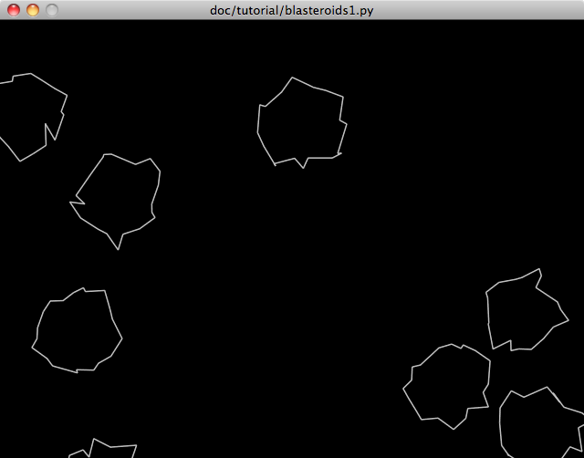

.. Grease tutorial chapter 1
.. include:: ../include.rst 

.. _tut-chapter-1:

######################
Grease Tutorial Part I
######################

In this tutorial, we will be creating a simple, but complete game. To make the most of this material, you should have a working Python 2.6 and Grease installation. The tutorial progresses through several revisions of an example game named *Blasteroids*. To keep things simple, all of the code in this game is in a single file. Each of the three tutorial parts builds a new revision of the game code. You can find the complete revisions of the tutorial game code for each part in the *doc/tutorial* subdirectory of the Grease source package.  

This tutorial assumes basic to intermediate knowledge and experience with the Python language. You should be comfortable with concepts like defining classes, and using decorators to get the most out of it.

Diving In
=========

.. index::
   single: pyglet library

Grease is built upon the excellent `Pyglet <http://www.pyglet.org/>`_ library. Pyglet provides the basic windowing, operating system event, scheduling and OpenGL graphics support for Grease. This tutorial assumes no prior knowledge of Pyglet or OpenGL, however it is not itself anything but a basic introduction to each. One of the advantages to Grease is that it abstracts away much of the details of using OpenGL, however its full power is still available to you if you need it. In fact there is no OpenGL-specific code in this tutorial, but some simple graphic programming concepts will be introduced.

*Blasteroids* is a facimile of the similarly named classic arcade game. I chose this game specifically because it is familiar and simple, yet still complicated enough to be a non-trivial example. It's also still fun to play after all of these years. To implement *Blasteroids* we will need the following basic functionality:

* Window with a graphics context
* A way to create polygonal shapes, move and draw them
* Keyboard event handler
* Collision detection
* Game logic for game lifetime and scoring
* Title screen and game mode handling

Starting from the top of our list, we will write the code that creates the window and graphics context. Luckily Pyglet makes that very easy::

    import pyglet

    def main():
        """Initialize and run the game"""
        global window
        window = pyglet.window.Window()
        pyglet.app.run()
    
    if __name__ == '__main__':
        main()

The above is a complete Pyglet program that creates a window and enters the event loop listening for system events. The window is declared :keyword:`global` because we will need to reference it elsewhere in the program to access things like its :attr:`width` and :attr:`height`. Although the above is not very interesting yet, it already has some important functionality. In particular the program will exit if the window is closed or the escape key is pressed. This functionality is included in the window's default :meth:`on_key_press()` event handler.

If you have not seen it before, the ``if`` statement at the end may appear a bit odd. This is a python idiom used in module files that can be run as scripts. Each module has a built-in :attr:`__name__` attribute set by the interpreter. The name ``"__main__"`` is used for a module that is being executed as a script. In our example this means that the :meth:`main()` function will be executed when the module is run as a script, but not it is imported by another module. Although our program is not intended to be imported by other programs, it can still be handy to do so from the python prompt for debugging. Without using this check, importing the module would unexpectedly execute :func:`pyglet.app.run()` to start the event loop, which would not return control to the importing program.

.. note:: You'll notice if you run the code above that the window may be filled with random garbage. That's because we don't clear the window using ``window.clear()``. Grease will take care of that for us soon, so bear with it for right now.

.. _tut-world-example:

.. index::
   single: World (tutorial overview)

The World of Grease
===================

Now that we have a window, we can move on to setting up our game environment. Grease provides a |World| class to organize and orchestrate all of the basic parts that we need. A convenient way to specify a world configuration is the subclass |World| and override the :meth:`configure()` method. This method gets called after the world is instantiated so that the application can configure it as desired. We need to configure the world with three different types of parts: components, systems and renderers. We'll start with components.

.. index::
   single: Component (tutorial overview)

Components
----------

Components specify the data fields for the entities in the game and store all of their data. If you are familiar with relational databases, components can be thought of like tables with entities as their primary keys. Don't worry too much about what an entity is just yet, once we get the world configuration setup, we'll delve more deeply into how they work.

Below is the first part of our world configuration that subclasses the |World| base class and configures some basic components:

.. literalinclude:: blasteroids1.py
   :pyobject: GameWorld
   :end-before: self.systems
   :linenos:

Components are accessed via the world attribute :attr:`components`. Above, attributes for each component we need are added. Although we can give the component attributes any names we want, other parts of the world will be easier to configure if we use standard names. The standard names of the built-in components are always the same as the class name, only lower case. If the component name has multiple words, it is recommended to use the `pep-8 <http://www.python.org/dev/peps/pep-0008/>`_ naming convention of :attr:`lower_case_with_underscores`. But bear in mind that the component attribute names are not magical and can be anything you want.

Below the built-in components used above are explained in more detail.

`Position`
	The position component stores entity position data. It has the fields :attr:`position` amd :attr:`angle`.

`Movement`
	The movement component describes how an entity moves over time. It has the fields :attr:`velocity`, :attr:`accel` and :attr:`rotation`.

`Shape`
	The shape component decribes poylgonal entity shapes. It has the fields :attr:`verts` and :attr:`closed`.

`Renderable`
	The renderable component stores some data about entity presentation. It has the fields :attr:`depth` and :attr:`color`.

Entities in a :class:`GameWorld` instance can now have data in any of these components.

.. index::
   single: System (tutorial overview)

Systems
-------

Now that we have some components for our world, let's move on to systems. Systems define behavioral aspects of the world. They execute at regular intervals to update the state of the world in particular ways. This often means they take data from one or more components to modify the data in others.  Below we add a standard system to our world configuration:

.. literalinclude:: blasteroids1.py
   :pyobject: GameWorld
   :end-before: self.renderers
   :linenos:

Similar to components, the world attribute :attr:`systems` is used to access the systems. Systems are also named using attributes, like components. Unlike components, however, the order of systems in the world is important. When the systems are executed each time step, they are executed in the order they were assigned to the :attr:`systems` attribute. Many times systems use the results calculated by other systems to do their work. System ordering allows the application to ensure that the world is updated in a consistent way. Of course since we only have a single system so far, we can't go too far wrong with the order.

.. note:: It is possible to insert a system out of order using the :meth:`world.systems.insert` method.

The :class:`~grease.controller.EulerMovement` system is responsible for updating the position and movement components. It performs a Euler integration each time step to update the :attr:`movement.velocity`, :attr:`position.position` and :attr:`position.angle` fields for all entities with both position and movement data. Systems access components in the world by name. By default, the :class:`~grease.controller.EulerMovement` controller assumes the position component it will use is named "position" and the movement controller is named "movement". This is just a convention, however. In fact you can have multiple position and movement components with different names if desired. For this application the defaults work fine, and require less configuration.

.. index::
   single: Renderer (tutorial overview)

Renderers
---------

The last piece of the world configuration puzzle are the renderers. Their role is unsurprisingly to create the visual presentation of the world. When the window needs to be redrawn, the renders will come to life and draw the world in its current state. We add two renderers to our world config:

.. literalinclude:: blasteroids1.py
   :pyobject: GameWorld

Like systems, renderer order is important. Renderers are always invoked in the order they are configured. 

Although renderers typically make an immediate visual change to the window, some, like :class:`renderer.Camera` change the drawing state for subsequent renderers to use. A camera renderer is a high-level way to setup the OpenGL state for further rendering. Setting the position of the camera translates all of the subsequent drawing. In our example, we position the origin point (0, 0) in the center of the window instead of the Pyglet default, which is the lower left corner. You can also set a zoom and angle for the camera to scale and rotate respectively. The camera's settings may also be changed at run time to easily implement features like panning and zooming.

The main workhorse renderer in our example is the :class:`~grease.renderer.Vector` renderer class. This renderer will draw shapes from the shape component in an old-school vector graphics style. As you may have guessed the :attr:`line_width` argument controls how fat the vector lines are drawn. This renderer draws all of the shapes in the component in a single batch using :const:`GL_LINES`. Because of this, all shapes drawn by this renderer must have the same line width. Even with this restriction, it is not difficult to use this renderer in cases where multiple line widths are needed. You will just need one :class:`~grease.component.Renderable` component and one :class:`~grease.renderer.Vector` renderer per desired line width.

We now have all the parts configured for our second goal: to create polygonal shapes, move and draw them. Now we just need to create some entities that store data in our components.

.. note:: Components, renderers, and systems coorespond closely to the models, views and controllers respectively of the `MVC design pattern <http://en.wikipedia.org/wiki/Model–view–controller>`_.

.. _tut-entity-example:

.. index::
   single: Entity (tutorial overview)

Defining an Entity Class
========================

In the abstract, entities represent the actionable items in a game. Anything that can interact or be interacted with is typically an entity. Entities are usually visible to the player and may have dynamic behavior such as movement, collision, or animation. In our example game we will be defining entities for several game objects, starting with one of the stars of the show, asteroids.

In concrete terms, Grease entities are rather simple things. Grease entities are instances of the |Entity| class. Typically applications will define various entity types by sublclassing |Entity|. Since entity data is stored in components, they have only two instance attributes: :attr:`entity_id` and :attr:`world`. The entity id is a unique identifier for the entity in the world. This is automatically assigned when the entity is created, and is usually invisible to application. The world is of course the |World| object where the entity resides. Entities are really just typed identifiers, so they are only meaningful in the context of a world, and actually cannot be created independently of a world.

Not let's put that theory into practice and define the :class:`Asteroid` entity class. Since asteroids are fairly static objects, we just need to establish their initial state. This is done in the conventional way by defining an :meth:`__init__()` method:

.. literalinclude:: blasteroids1.py
   :pyobject: Asteroid
   :linenos:

Let's dissect this to see what's going on. The class declaration is straightforward enough, we simply subclass |Entity|. It's worth stating that this is not optional. The :class:`Entity` base class contains several essential facilities to make it fit into a world context.

After the docstring (always a good idea), we have a standard class attribute declaration:

.. literalinclude:: blasteroids1.py
   :pyobject: Asteroid
   :start-after: """
   :end-before: __init__

Since our asteroids are basically distorted circles, this sets up a list of points along a unit circle to use as a base shape. Although instance attributes of entities are fixed, you can define as many class attributes as desired. It's important that their names do not clash with the component accessors (which we'll be getting to next). Using a naming convention, such as :attr:`UPPER_CASE_WITH_UNDERSCORES` as above avoids name collision problems handily.

Next let's go into the entity constructor:

.. literalinclude:: blasteroids1.py
   :pyobject: Asteroid.__init__
   :end-before: movement

The method declaration is conventional, however the second :attr:`world` argument is mandatory. As you might imagine this is the world object that the entity has been created in. Although you must receive this argument, you do not need to do anything with it in your :meth:`__init__()` method. The :class:`Entity` base class takes care of assigning the :attr:`world` and :attr:`entity_id` attributes for you in its :meth:`__new__()` method. After the :attr:`world` argument you can define any additional arguments you need. Here we add a radius argument so that asteroids of various sizes can be created with this class.

The first statement in our constructor sets the position of the asteroid. The position is random, though it avoids placing asteroids directly in the middle of the window. The position value is not stored in the asteroid instance, however. Accessing :attr:`self.position` provides a component accessor for the new entity. This accessor lets you inspect and manipulate data in the world's :attr:`position` component for this entity. The attributes of the position accessor let you read and write the field values for this entity in the position component. This lets you code using a conventional style from the point of view of the entity object, while keeping the data centralized in the components.

There is also another important thing happening here. Components are like sets of entities. Initially a new entity belongs to none of the components. By assigning a value to a component field, the entity is automatically added to the component if it is not already a member. So our position assignment above first adds the entity to the position component, then sets the value of the position field for the entity. There is no need to add the entity to the component separately.

So you can read the above assignment statement as, *"add the entity to the position component and set the position field of the position component to a random 2D vector."*

Now let's tackle movement:

.. literalinclude:: blasteroids1.py
   :pyobject: Asteroid.__init__
   :start-after: window.height
   :end-before: verts

The velocity is a 2D vector much like position. We set it to a random value, that on average will be faster for asteroids with a smaller radius.

Note how we can assign 2D vectors using just a 2 element tuple. These are converted into more specialized :class:`Vec2d` objects when the value is stored in the velocity field. Although you can assign :class:`Vec2d` objects directly to the fields, any 2 element sequence of numbers will also work, and for initialization tuples are often very convenient.

The rotation is set at a slow random value centered around zero. The zero mean will result in an approximately equal number of asteroids rotating clockwise as counterclockwise. The rotation values are in degrees per second, with positive values being clockwise.

Next up is the shape:

.. literalinclude:: blasteroids1.py
   :pyobject: Asteroid.__init__
   :start-after: rotation
   :end-before: renderable

I broke this into two lines to make it a little easier to follow, it could be done on one line if desired. The first line sets up a list of 2D vertex coordinates for a polygon shape. The shape is offset and rotated by the position component values when it is used, so the coordinates here are relative to the "local origin" which in this case is at the center of each asteroid shape. To create the desired irregular shape, we step through the unit circle multiplying each unit coordinate by the radius. The gaussian random function adds a random deviation to each vertex location. The amount of deviation is proportional to the asteroid size.

The second line just takes our randomized vertices and stores them in the shape component for our asteroid entity.

Lastly, we set the asteroid color, to a nice dusty light gray:

.. literalinclude:: blasteroids1.py
   :pyobject: Asteroid.__init__
   :start-after: self.shape.verts
   :end-before: bugworkaroundthisis

In order for the vector renderer to draw the entity, it must be a member of the position, shape and renderable components. Now that we have added data for our asteroids in all of those components, the renderer will draw them.

So there there you have it, 2D procedural vector asteroids! 8^)

Tying It Together
=================

Before we can see our ponderous space boulders plodding through space, we need to tie up a few loose ends. Before it will work, we need to:

* Create an instance of the :class:`GameWorld` we defined.
* Schedule the :class:`GameWorld` for updates.
* Push the :class:`GameWorld`'s event handlers on the window to receive events.
* Create some :class:`Asteroid` instances.

We'll modify the :func:`main()` function to include this functionality:

.. literalinclude:: blasteroids1.py
   :pyobject: main

World objects contain their own local clock, which is used by default to invoke the world's systems. To make the world clock run, we must schedule the world's :meth:`tick()` method with the global Pyglet clock.

The world also contains an :meth:`on_draw()` event handler that invokes the world's renderers. By pushing the world onto the window, the renderers will redraw the window automatically.

The last change was to instantiate some :class:`Asteroid` entities. Note that we don't actually keep any references to them in our main function. Creating the asteroids automatically stores references to them in :attr:`world.entities`, so we don't need any outside references. You can certainly keep local references to entities if needed, but since we do not need to reference the asteroids individually in our example, we can omit them.

We now have a working start to the game. The full source of our first revision can be found in :download:`blasteroids1.py`. The screenshot below shows what our handiwork looks like:

**Next:** :ref:`Grease Tutorial Part II: Making a Game of it <tut-chapter-2>`
