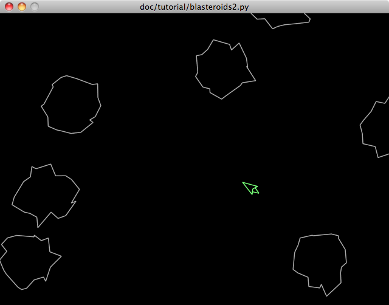
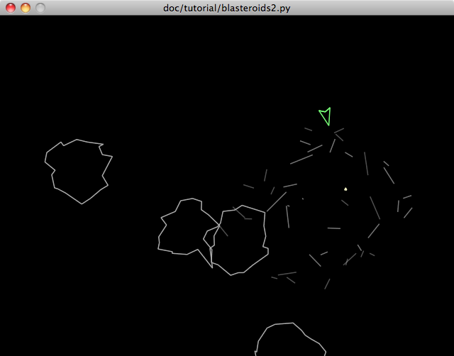

.. include:: ../include.rst 
.. _tut-chapter-2:

#######################
Grease Tutorial Part II
#######################

Making a Game of it
===================

.. index::
   pair: PlayerShip (example); Entity

In :ref:`part 1 <tut-chapter-1>` of the tutorial the basis was laid for the *Blasteroids* game, but it is far from complete or even playable. By the end of this chapter, we'll have rectified that. To start with, let's build on the techniques we used to create the :class:`Asteroid` class, and create an entity for the player's ship.

The start should look pretty familar, and even a bit simpler than the asteroids:

.. literalinclude:: blasteroids2.py
   :pyobject: PlayerShip
   :end-before: collision
   :linenos:

First we have some class attributes that configure various aspects of the ship, including thrust acceleration, turn rate, shape (vertex points) and color. Separating these values out of the code makes them easier to tweak while testing the game, and also will allow us to refer to them from other code, which can be convenient.

It's probably difficult to envision the shape from just the vertex coordinates, so here's what the ship will look like renderered:

The shape has some intentionally overlapping vertices (the part labelled `flame` on line 7), so we can easily create a simple animated flame effect coming from the rear of the ship when the thrust is activated.

In the constructor, we setup the initial position and angle (centered and pointing up), stationary movement and rotation (lines 15-18). Next the shape is initialized, this time with the :attr:`closed` field set to false since we have overlapping vertices in the shape. Last, we set the color. This puts the ship entity into all of the components we need for movement and rendering.

Unlike asteroids, the player's ship needs to be able to move dynamically in response to player inputs. Specifically, the ship needs to be able to turn (rotate) left and right, and accelerate forward in the direction it is facing to simulate thrust. Let's start with the turn method:

.. literalinclude:: blasteroids2.py
   :pyobject: PlayerShip.turn

This simple method lets us turn the ship left or right by supplying the proper direction value: ``-1`` for turn left, ``1`` for turn right, ``0`` for straight ahead.

Let's move on to the thrust method:

.. literalinclude:: blasteroids2.py
   :pyobject: PlayerShip.thrust_on

This method accelerates the ship in the direction it is facing. We start by defining an upward-facing vector with a magnitude set to the class's :attr:`THRUST_ACCEL` value. This vector is then rotated in-place to face the direction of the ship using :meth:`Vec2d.rotate()`. The :attr:`accel` field of the entity's movment component is then set to the rotated thrust vector. The :class:`~grease.controller.EulerMovement` system, already in the world takes care of calculating the ship's velocity and position over time based on the acceleration. 

The last line changes one of the shape vertices, moving it to a random position behind the ship. This will create a simple flickering flame animation that will act as an import cue to the player that the thrust is active. Notice that the vertex is simply moved to a random position vertically relative to the origin, the renderer will automatically take care of translating and rotating the vertex to the proper window coordinates according to the ship's current position and rotation, as well as the current camera settings.

We will be wiring the :meth:`thrust()` method to fire every frame that the thrust key is held down. That way the acceleration vector will always be pointing in the right direction if the ship is also turning and the thrust flame will continuously flicker.

The last thing we need is a method to turn the ship's thrust off. We'll wire this up to fire when the thrust key is released:

.. literalinclude:: blasteroids2.py
   :pyobject: PlayerShip.thrust_off

This resets the ship's acceleration and flame tip vertex back to their original values.

.. _tut-controls-example:

.. index::
   single: KeyControls (tutorial example)
   single: KeyControls; GameSystem (example)

Controlling the Ship
====================

None of the capabilities we've coded for the player's ship mean anything unless the player can control them. Here we are going to see how easy it is to wire up our game logic to the keyboard.

To do this, we are going to create our own custom |System| to house our top-level game state, logic, and keyboard bindings. Because the example game is simple, we can easily fit all of these things into a single system class.

Remember that systems are behavioral aspects of our application, and are invoked each time step. So they are the perfect place to define and glue together the logic for the game.

.. literalinclude:: blasteroids2.py
   :pyobject: GameSystem
   :end-before: @

We start by defining our :class:`GameSystem` as a subclass of :class:`~grease.controls.KeyControls`. :class:`KeyControls` is a system subclass that provides a convenient mechanism for binding its methods to keyboard events.

The :meth:`set_world` method is overridden to include a call to create a :class:`PlayerShip` entity and store it in the game state. Since there is only one player ship, this is an easy way to keep track of it so that we can call it's methods in response to particular key presses. We make the entity here in this method -- instead of, say :meth:`__init__` -- because this method is called when the system is added to the world. Since we need a reference to the world in order to create an entity, this is the most convenient place to do so.

Next let's add a method to turn the ship left when either the "a" or left arrow keys are pressed:

.. literalinclude:: blasteroids2.py
   :pyobject: GameSystem
   :start-after: PlayerShip
   :end-before: key_release

The first thing of interest are the two decorators at the top. The :meth:`KeyControls.key_press` decorator binds a method to a key press event for a specific key. As you can see from the code, we can have multiple key binding decorators for a given method to bind it to multiple keys. The decorator method takes one or two arguments. The first argument is the Pyglet key code from :obj:`pyglet.window.key`. The second optional argument is to specify modifier keys (shift, alt, etc). By default, no modifier keys are assumed.

The logic in this method is quite simple. First we check that the :obj:`player_ship` entity exists. This ensures that the entity has not been deleted from the world before we use it. Just holding a reference to an entity does not prevent it from being deleted. In this way entity references in your code are like weak references. This check will prove useful when the player ship can be destroyed later on. Next we call the ship entity's :meth:`turn_left` method we defined earlier passing it a direction of ``-1``.

Next we add a complimentary method to stop turning left:

.. literalinclude:: blasteroids2.py
   :pyobject: GameSystem
   :start-after: turn(-1)
   :end-before: key_press

The decorators here bind this method to the key release event for the same keys. The methods check for the existence of the entity as above, but also that it is currently turning left (negative rotation). This is to properly handle simultaneous key presses, e.g., left down, right down, then left up.

The methods for handling turning right are the same as above with the direction reversed:

.. literalinclude:: blasteroids2.py
   :pyobject: GameSystem
   :start-after: turn(0)
   :end-before: key.SPACE

For activating thrust, we use the :meth:`~grease.controls.KeyControls.key_hold` decorator. This works differently than the key press and release decorators we used for turning. The press and release decorators configure a method to fire once for each specific key event. The key hold decorator configures a method to fire continuously, once per time step, as long as the specified key is held down. This is perfect for thrust, which needs to be adjusted continously as the ship turns, and runs a continuous animation while activated.

The :meth:`stop_thrust` method is simply bound to key release, to ensure the thrust is deactivated at the proper time.

With the key control logic code in place, the next step is to add the :class:`GameSystem` to our :class:`GameWorld`'s systems (Line 16 below):

.. literalinclude:: blasteroids2.py
   :pyobject: GameWorld
   :linenos:

We also modify the :func:`main` function to push the system's event handler onto the game window so that it receives the key events (Line #7 below):

.. literalinclude:: blasteroids2.py
   :pyobject: main
   :linenos:

Now we can control the ship and fly it around the screen.

.. index::
   single: Collision (tutorial example)

Running Into Stuff
==================

Flying around is way too safe at the moment, since you can't actually run into anything! Let's see what we can do about that. Implementing collision requires that we add a component and a system to the :class:`GameWorld`: 

.. literalinclude:: blasteroids2.py
   :pyobject: GameWorld
   :linenos:

The :class:`~grease.component.Collision` component (line 9 above) has the fields we need to make the collision system (line 13-14 above) work. The fields in this component are:

`aabb`
    This is the axis-aligned bounding box that contains the entity. This box is used in the collision detection system to quickly reduce the number of collision checks that need to be performed. We can also use it for our own purposes when we need to find the top, left, bottom or right edges of entities.

`radius`
   The meaning of this field is up to the specific collision system used. For :class:`~grease.collision.Circular` systems, entities are approximated as circles for the purposes of collision detection. The radius value is simply the radius of the collision circle for an entity.

`from_mask` and `into_mask`
   Not all entities in the collision component need to be able to collide with each other. These two mask fields let you specify which entities can collide. Both mask fields are 32 bit integer bitmasks. When two entities are compared for collision, the :attr:`from_mask` value from each entity is bit-anded with the :attr:`into_mask` of the other. If this bit-and operation returns a non-zero result, then a collision is possible, if the result is zero, the entities cannot collide. Note that this happens in both directions, so a collision can occur between entity A and B if ``A.collision.from_mask & B.collision.into_mask != 0 or B.collision.from_mask & A.collision.into_mask != 0``.

Let's take a closer look at how the collision system is configured above:

.. literalinclude:: blasteroids2.py
   :pyobject: GameWorld
   :start-after: self.systems.game
   :end-before: sweeper

There are two major steps to collision handling in Grease: *collision detection* and *collision response*. The detection step happens within the collision system. A set of pairs of the currently colliding entities can be found in the :attr:`collision_pairs` attribute of the collision system. Applications are free to use :attr:`collision_pairs` directly, but they can also register one or more handlers for more automated collision response. Collision handlers are simply functions that accept the collision system they are configured for as an argument. The handler functions are called each time step to deal with collision response.

Above we have configured :func:`~grease.collision.dispatch_events` as the collision handler. This function calls :meth:`on_collide` on all entities that are colliding. The entities' :meth:`on_collide` handler methods can contain whatever logic desired to handle the collision. This method accepts three arguments: :attr:`other_entity`, :attr:`collision_point`, and :attr:`collision_normal`. These arguments are the other entity collided with, the point where the collision occured and the normal vector at the point of collision respectively. It is up to the handler method to decide how these values are used. Note that when two entities collide, both of their :meth:`on_collide` handler methods will be called, if defined.

In our game we will leverage the collision masks to make it so that the player's ship collides with asteroids, but the asteroids do not collide with each other. To do that we need to modify the :class:`Asteroid` and :class:`PlayerShip` constructors to set the collision component fields.

.. literalinclude:: blasteroids2.py
   :pyobject: PlayerShip
   :end-before: def turn
   :linenos:

Lines 21-22 above initialize the collision settings for the player ship. Note that the radius is set slightly smaller than the farthest vertex in the shape (by 0.5 units). This is common when using circular collision shapes, it prevents the appearance of false positive collisions that can make the game feel unfair.

.. literalinclude:: blasteroids2.py
   :pyobject: Asteroid
   :end-before: def on_collide
   :linenos:

Lines 18-20 above setup collision for the asteroids. The radius is simply set to the asteroid's radius. The collision masks are configured so that the asteroids will collide with the player's ship, but not with each other.

To start with, will add a simple :meth:`on_collide` method to both the :class:`Asteroid` and :class:`PlayerShip` classes that simply delete the entities when they collide::

        def on_collide(self, other, point, normal):
            """Collision response handler"""
            self.delete()

.. index::
   pair: Particle Effect (tutorial); Entity

Blowing Stuff Up
================

When you run the game now, you'll notice that asteroids pass right through each other, but if you hit one with the ship, both the ship and asteroid disappear. This proves that the collision is working as expected, but it's not very interesting yet. What would really spice things up are some simple explosion effects when entities are destroyed. 

Here's what we need to implement to make stuff explode:

* A method to "explode" an entity into a bunch of debris fragments.

* A system that manages the debris, fading it out and cleaning it up over
  time.

Let's start with the :meth:`explode` method. Since asteroids and the player ship are basically the same except for their shape, they can share the method code. The most straightforward way to do this, is to create a common base class for both entities:

.. literalinclude:: blasteroids2.py
   :pyobject: BlasteroidsEntity
   :linenos:

We also define an entity class for the debris. This class defines no behavior of its own, it just serves to tag the debris entities so that we can easily manage them in the system we will be creating later:

.. literalinclude:: blasteroids2.py
   :pyobject: Debris

Let's take apart the :class:`BlasteroidsEntity` class and see how it works. In line 6 above, we take the base shape of the entity and transform it into a new shape, rotating it to the current angle of the entity that is exploding:

.. literalinclude:: blasteroids2.py
   :pyobject: BlasteroidsEntity
   :start-after: """
   :end-before: for segment

Next we create the debris. This is aided by the :meth:`shape.segments` method (line 7). This method returns an iterator of all of the individual line segments of the original shape as separate shapes. This effectively fragments our original entity shape. 

We loop over these fragment segments creating debris entities for each. The shape of each debris fragment is a single segment of the original entity's shape. We also set the initial position and velocity of the debris entity to that of the exploding entity (line 10-11). Next we add some random velocity outward from the exploding entity's position to make it "explode" (line 12). Because the base shapes are centered around the origin, we can just use one of the vertex positions to determine the approximate outward direction from the center. Normalizing the first vertex vector -- giving it a length of 1 -- and multiplying it by a random value gives us the desired outward push. A bit of random rotation adds a little spice to the effect (line 13). Last, we set the color of the debris to the same as the original entity so they appear to be pieces of the original.

To trigger the explosions, we simply need to change the base class of our :class:`PlayerShip` and :class:`Asteroid` classes to :class:`BlasteroidsEntity` and add a call to :meth:`explode` in their :meth:`on_collide` methods::

        def on_collide(self, other, point, normal):
            """Collision response handler"""
            self.explode()
            self.delete()

.. index::
   pair: Sweeper (example); System

Cleaning Up the Mess
""""""""""""""""""""

Blowing stuff up is great fun, of course, but at some point we need to clean up the debris. We'll accomplish this by adding a custom :class:`Sweeper` system:

.. literalinclude:: blasteroids2.py
   :pyobject: Sweeper
   :linenos:

This is first system we've created from scratch, so let's look a little deeper at what a system actually is. You'll notice we are subclassing |System| an abstract base class defined by the framework. Subclassing |System| is optional, though it helps make it clear what type of part the class defines.

The only method that a system must implement is :meth:`step`. The :meth:`step` method is called by the world every time step, passing in the time delta since the last time step as a float. This is where the system implements its business logic.

Optionally a system can implement a :meth:`set_world` method. If defined, this method is called when the system is added to a world, passing the |World| instance as its argument. This can be a good place to do system initialization where you need a world object, such as we did with the :class:`GameWorld` system implementation earlier. The |System| base class defines a simple implementation of :meth:`set_world` that stores a reference to the system's world for convenient access to its entities, components or even other systems.

The :attr:`SWEEP_TIME` value defined on our class specifies the time debris will live before it is "swept up" by the system and deleted. As this time elapses, the alpha value of each debris entity's color is slowly reduced, fading the debris away.

We determine the amount to fade the debris for each time step by dividing the time delta ``dt`` by the :attr:`SWEEP_TIME` (line 7 above). This works because the color component values are floating point numbers between 0 and 1.0: 

.. literalinclude:: blasteroids2.py
   :pyobject: Sweeper
   :start-after: def step
   :end-before: for entity

Next we loop iterating through the :class:`Debris` entities. We do this by accessing the *entity extent* for :class:`Debris`. This extent is accessed by using the :class:`Debris` class as a key to the world::

    self.world[Debris].entities

The entity extent object returned by ``self.world[Debris]`` has an attribute :attr:`entities` which is the set of all entities for that extent in the world. This conveniently gives us all of the debris entities in existence. You'll notice that in the for loop on line 7, we turn this set of entities into a tuple:

.. literalinclude:: blasteroids2.py
   :pyobject: Sweeper
   :start-after: fade =
   :end-before: color =

This makes a copy of the set to iterate over, so we can safely remove debris entities from the world inside the loop. Without making a copy, we might actually change the members of the :attr:`entities` while iterating it, which at best would cause an exception, and at worst would result in some entities being skipped over. Any time you iterate over a mutable sequence, such as a list, set or dict, you need to be careful about changes to that sequence while iterating it. This tends to be a common gotcha in Python game development.

Inside the loop things are pretty straightforward. For each debris entity, we get the color from the renderable component (line 9). Color objects have the attributes :attr:`r`, :attr:`g`, :attr:`b`, and :attr:`a` for their red, green, blue, and alpha values. We only care about the alpha in this system. For alpha values greater than 0.2, we fade it a bit to a minimum value of zero. If the alpha value is not greater than 0.2, we delete the debris entity entirely (lines 10-13).

Now that the :class:`Sweeper` class is implemented, the last thing we need to do is add it to our game world. We just need to add this line to the :meth:`configure` method of the :class:`GameoWorld` class::

    self.systems.sweeper = Sweeper()

Now the debris fragments fade away and disappear a short time after the entity explodes.

.. note::
   What's powerful about systems is their ability to define behavioral aspects of the world. With this simple system, we now control the behavior and lifespan of all debris, regardless of where, why or how they are created. If we add new sources of debris later, this system will automatically handle them without additional effort.

.. Animation frames go here

Shoot Me Now
============

Alright, so now we have collisions and explosions working, what more could we want in a game? Well, there's a big problem: The only way to blow things up is to use the ship as a battering ram. We need a way to destroy things without also committing suicide. If only there was a game mechanic we could use....hmmm.

Ok, enough fooling around, we need to be able to shoot stuff! To do that we need some sort of gun. For our purposes, a gun is a device that can shoot out :class:`Shot` entities. Since such a "device" might be useful for other entities besides the :class:`PlayerShip`, it would be useful to implement as a behavioral aspect of the game. 

The best way to implement such aspects, as we've seen, is to use a system. It might not seem obvious when a feature should be implemented using a system, versus just a method on the entity class, like :meth:`explode` above. Of course, these things are not cut and dried and there is no right or wrong way, but systems offer some advantages in certain situations:

#. The behavior is tied to specific components.
#. The behavior is continuous or recurs over time.
#. The behavior is not specific to a particular entity.

If any one of the above is true, you should consider implementing the behavior as a system. In our case, we will be defining a custom :obj:`gun` component to store some state for guns, and the behavior recurs periodically over time (If you hold down fire). Right now #3 above is not true, but if we were to implement alien ships that could shoot at the player later, it would be. All in all I think that makes a compelling case for using a system here.

.. _custom-component-example:

.. index::
   pair: Component (tutorial); Custom

The first thing we need is a component to store some gun state. This will be used to determine when the gun can shoot. Three pieces of information are needed for this: a flag to determine if the gun should fire, the last time the gun was shot, and the minimum "cool down" time between shots. We can add a custom component to the :class:`GameWorld` to store this information in three fields::

        self.components.gun = component.Component(
            firing=bool, 
            last_fire_time=float, 
            cool_down=float)

The |Component| class lets us create custom components with user-defined fields. To construct a custom component, we specify the fields as keyword arguments. The names of the arguments specify the names of the fields. The value of each argument specifies the data type for each field. Since the data type is fixed, this makes component fields more rigid than conventional Python attributes, but it provides some important benefits:

#. Component values can be stored in compact data structures using native data types where possible (int, float, Vec2d, etc).
#. Component data can be stored in contiguous data blocks for much faster batch operations.
#. Fields have sensible default values.
#. Input values can be automatically cast to the proper field type 
   (e.g., 2-tuples to |Vec2d|, hex strings to |RGBA|)
#. Systems and other users of component data know exactly what type of data to expect
   for each field.

An important drawback to this arrangement is that fields must always have a value of the proper type. So it is not possible to assign a value of ``None`` to a float field, for instance. 

.. Note::
   The only difference between custom and built-in components is that the fields for the former are already specified for convenience. Using custom components has no drawbacks other than the additional configuration required.

With the :obj:`gun` component in place, lets modify the :class:`PlayerShip` class to initialize the gun data:

.. literalinclude:: blasteroids2.py
   :pyobject: PlayerShip
   :end-before: def turn
   :linenos:

We add a class attribute on line 12 to specify a one half second cooldown for the gun. On line 24 we set this value in the :obj:`gun` component. We do not have to explicitly set the :attr:`firing` and :attr:`last_fire_time` fields. They will automatically default to ``False`` and ``0`` respectively.

.. index::
   pair: Shot (example); Entity

Shot Class
""""""""""

Now let's implement the :class:`Shot` entity class for our bullets:

.. literalinclude:: blasteroids2.py
   :pyobject: Shot
   :end-before: def on_collide
   :linenos:

We start with some class attributes (line 4-5) to specify the shot's speed and time-to-live. The latter is an indirect way to specify the range for the shot.

Next we define the constructor, which in addition to the required :obj:`world` argument, takes a :obj:`shooter` entity and :obj:`angle` value. The shooter is the entity that the shot is being fired from. The angle determines the direction of the shot.

Inside the constructor, we first determine the initial position of the shot (lines 8-10). This is done by computing an offset based on the shooter's collision radius and the input angle. This way the shot appears to come from the surface of the shooter, rather than the center. The velocity is calculated by multiplying the angle's unit vector by the shot's speed, plus the shooter's velocity. Without including the shooter's velocity, the shooter could actually outrun his own shots, and strafing would feel very unnatural.

The shape of the shot is set to a small triangle (line 13). This is small enough so that it will appear to be a small dot when rendered.  Collision is setup with a small radius and a mask specifically designed to collide with everything except for the shooter (``~`` is Python's bit-invert operator). Setting the color ensures the shot is rendered.

On line 17 we schedule the shot to expire at the proper time. The clock will call the expire method (defined below) when the time-to-live elapses, deleting the entity automatically. This means that we do not need to keep track of when each shot will expire ourselves, which is convenient.

We have two more methods to implement for :class:`Shot`: an :meth:`on_collide` handler for collision and an :meth:`expire` method for handling the shot expiration. Both will simply delete the entity:

.. literalinclude:: blasteroids2.py
   :pyobject: Shot.on_collide
.. literalinclude:: blasteroids2.py
   :pyobject: Shot.expire

.. index::
   pair: System; Gun (example)

Gun System
""""""""""

With the :obj:`gun` component and :class:`Shot` class implemented, we can finally finish things off by implementing the :class:`Gun` system:

.. literalinclude:: blasteroids2.py
   :pyobject: Gun
   :linenos:

This is even shorter than the :class:`Sweeper` system that we implemented previously, but there are some new things here that bear explanation, in particular on line 5. In the :class:`Sweeper` implementation, we discussed how to use entity classes as keys on the world to retrieve entity extents. In many cases though, you want to get the extent containing all entities instead of just one particular type. To do this you use the special Python ellipsis symbol (``...``) as a key::

		world[...]

This means: "give me the extent of all entities in the world."

In :class:`Sweeper`, we used the extent just to get a set of entities of a particular type. But extents can do far more than that, they can also be used to create query expressions.

You can think of extents as a batch of entities, and like individual entities you can access components as attributes of extents. Only instead of accessing a single component record for an entity, an extent accessor selects them for the entire extent. For instance::

		world[...].gun

This returns a special set of all entities in the :obj:`gun` component. It's special because we can use it to query fields in the component. For example::

		world[...].gun.firing == True

That looks like an innocent boolean expression, but it is actually much more than that. This expression returns a set of all entities where the component field ``gun.firing`` matches the value ``True``. So this expression returns the set of all entities currently firing their gun. We can iterate this set, as we do in line 5 above, to perform the neccessary logic in our system.

On line 6 we check if the entity's gun is ready to fire. ``self.world.time`` is the local timestamp of the world object, updated every time step. If the gun is ready to fire, we create a :class:`Shot` entity and update the ``last_fire_time`` so the gun can begin its cool down cycle again.

As you may have guessed, now that we have our :class:`Gun` system implemented, we need to add it to the :class:`GameWorld` class::

		self.systems.gun = Gun()

In addition, we need to add some methods to the :class:`GameSystem` class to fire the player ship's gun when the space bar is pressed:

.. literalinclude:: blasteroids2.py
   :pyobject: GameSystem
   :start-after: self.player_ship.thrust_off
   :end-before: GameWorld

These methods simply set the :attr:`gun.ship` flag when space is pressed, and reset it when space is released.

With all of this in place we can finally blast those asteroids to smithereens!

.. _tut-system-example:

.. index::
   pair: System; Wrapper (example)

Wrapping Things Up
==================

We've now implemented all of the major game mechanics, save one. You'll notice if you fly around for a few seconds, all of the asteroids fly off the screen and disappear. And so will the player's ship if you accelerate it in one direction. We forgot to implement the all-important toroidal space topology! That's fancy-talk for making objects wrap around when they fly off the edge of the screen.

So, how do you suppose we're gonna fix this? Surprise! Another system! This is a textbook example of a behavioral aspect of the application:

.. literalinclude:: blasteroids2.py
   :pyobject: PositionWrapper
   :linenos:

The constructor (lines 4-6) precalculates the half width and height of the window for convenience later. Remember that the origin is in centered in the window, so these values are handy for finding the edges.

The :meth:`step` method performs four entity extent queries, in the same spirit as in the :class:`Gun` system. Here we are querying the edges of the entities using their collision bounding boxes, comparing them to the window edges. In the first loop (line 9-10) we iterate over all entities whose right edge has moved left beyond the left edge of the window. This extent query does the job::

		self.world[...].collision.aabb.right < -self.half_width

For all of the entities matched by this expression, we move them to the right the full width of the window plus the width of the entity which we can also conveniently get using the bounding box.

The remaining 3 loops are essentially the same except each handles a different window edge.

Naturally once we have this class implemented, you guessed it, we need to add it to the :class:`GameWorld`::

        self.systems.wrapper = PositionWrapper()

With this now in place, all of the entities in the collision component (asteroids, the player ship, shots) will automatically wrap around when they fly offscreen.

:download:`blasteroids2.py` contains the full source of the second revision of the game.

**Next:** :ref:`Grease Tutorial Part III: Spit and Polish <tut-chapter-3>`
