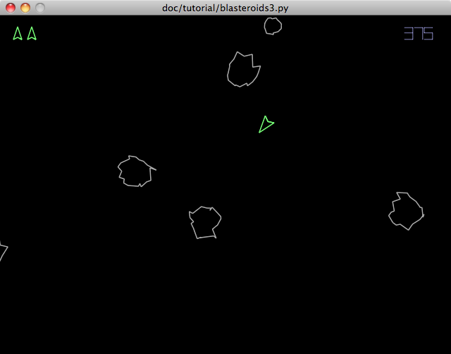
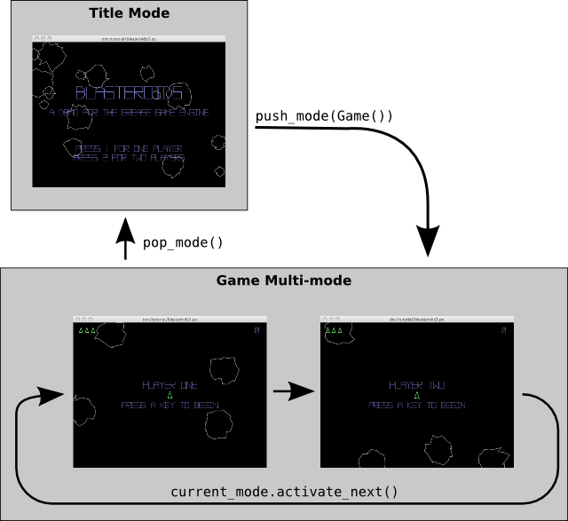
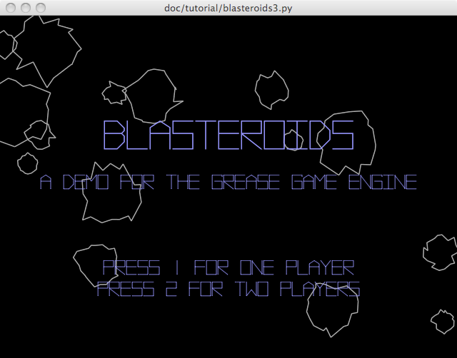

.. include:: ../include.rst 
.. _tut-chapter-3:

########################
Grease Tutorial Part III
########################

.. index::
   single: Sound Effects (tutorial)

Crash, Bang, Boom!
==================

Let's start by having some fun with some sound effects. The sound functionality itself is provided by Pyglet, but we will be seeing how to tie it into the game logic we already have. To start with, let's define some helper functions to help with loading and configuring the sounds:

.. literalinclude:: blasteroids3.py
   :start-after: ## Utility functions ##
   :end-before: font
.. literalinclude:: blasteroids3.py
   :pyobject: load_sound
.. literalinclude:: blasteroids3.py
   :pyobject: looping_sound

First we define a constant :obj:`SCRIPT_DIR_PATH` to store the path to the script's directory. The ``__file__`` module global is set by Python to the file path of the running script. Using :func:`os.path.dirname` we get the path to the containing directory so that we can construct file paths relative to it. This way we can find our sound files regardless of the current working directory when the script is run.

The :func:`load_sound` function is a simple wrapper around :func:`pyglet.media.load` that loads sound files from the ``sfx`` directory adjacent to the script. The false default value for the :attr:`streaming` argument means that by default the files will be preloaded into memory, which is best for short sound effects.

The :func:`load_sound` function creates fire-and-forget sounds that always play all the way through. We also add a :func:`looping_sound` function for continous-play sounds. This creates the sounds as streaming, which is suitable for longer sound effects or music. It also returns a full fledged :class:`pyglet.media.Player` object which affords us more control than a simple sound object.

For a simple game like this, with relatively few sounds, we can ensure that all the sounds are preloaded by storing them as class attributes in the entities that will use them. This will work because these class attributes are evaluated right after the script, or module, is first loaded by Python. In a more complex game with more assets to load, a more sophisticated preloading mechanism that provides feedback to the player is probably warranted.

Let's modify the :class:`PlayerShip` class to load some sounds:

.. literalinclude:: blasteroids3.py
   :pyobject: PlayerShip
   :end-before: __init__

We can play the death sound when the player's ship is destroyed, by adding a line to the :meth:`on_collide` method:

.. literalinclude:: blasteroids3.py
   :pyobject: PlayerShip.on_collide
   :end-before: player_died

The thrust sound is a looping sound. It should loop continously so long as the thrust is on and stop as soon as the thrust is off. This is accomplished by some simple modifications to the :meth:`thrust_on` and :meth:`thrust_off` methods to play and pause the thrust sound:

.. literalinclude:: blasteroids3.py
   :pyobject: PlayerShip.thrust_on
.. literalinclude:: blasteroids3.py
   :pyobject: PlayerShip.thrust_off

The gun sound is a bit more involved. Since the :class:`PlayerShip` class does not fire the gun directly, we will not actually play the sound here. We need to provide the sound to the :class:`Gun` system, so that it can play it when the gun actually fires. A good way to do this is to store the sound in a field of the gun component. We can modify the :class:`PlayerShip` constructor to do this like so::

    def __init__(self, world):
        ...
        self.gun.cool_down = self.GUN_COOL_DOWN
        self.gun.sound = self.GUN_SOUND

For this to work, we will need to reconfigure the gun component in the :class:`GameWorld` class, adding a :attr:`sound` field::

		class GameWorld(grease.World):

			def configure(self):
				"""Configure the game world's components, systems and renderers"""
				...
				self.components.gun = component.Component(
					firing=bool, 
					last_fire_time=float, 
					cool_down=float, 
					sound=object)
				...

By assigning a type of ``object`` to the :attr:`sound` field, we can assign any Python object to it, which is perfect for this purpose.

Last we need to modify the :class:`Gun` system to play the sound when the gun is fired (lines 8-9 below):

.. literalinclude:: blasteroids3.py
   :pyobject: Gun
   :linenos:

.. note:: Another viable solution would be to add this sound to the :class:`Shot` entity, but using the component is more flexible and illustrates how you can leverage object fields.

With some simple modifications to the :class:`Asteroid` entity class, we can add sounds when they explode. First let's load three hit sounds in a class attribute:

.. literalinclude:: blasteroids3.py
   :pyobject: Asteroid
   :end-before: UNIT_CIRCLE

Then play one of these sounds at random when the asteroid is hit::

    def on_collide(self, other, point, normal):
        random.choice(self.HIT_SOUNDS).play()
        self.explode()
        self.delete()

It's amazing what an improvement these simple sound effects make to the game. These sounds were created using the brilliant, free 8-bit sound effect generator: *sfxr*. You can download it `for Windows <http://games.softpedia.com/get/Tools/sfxr.shtml>`_ , and `for Mac <http://mac.softpedia.com/get/Developer-Tools/cfxr.shtml>`_.

He Shoots, He Scores!
=====================

No self-respecting arcade game can show its face in public without scoring. How am I to know how much better I am than the next guy? Obviously we need to implement some scoring before going any further.

Currently when you shoot an asteroid, it is simply destroyed. This is not much of a challenge. Like the classic game, we need to make the asteroids break into fragments when they are hit. The smaller asteroid fragments will move faster than their parents and give the player more points when shot. Let's refactor the :class:`Asteroid` entity class to provide these features:

.. literalinclude:: blasteroids3.py
   :pyobject: Asteroid
   :linenos:

First some arguments are added to the constructor: :attr:`position`, :attr:`parent_velocity`, and :attr:`points` (line 14). If :attr:`position` is provided, it is used as the initial asteroid position rather than always having a random initial position (line 20). If :attr:`parent_velocity` is provided, it is added to the random velocity vector (line 22-23), this way fragments are influenced by their parent's movement. Last, we store the point value for the asteroid in a new :attr:`award` component (line 32). Of course we'll need to add this component to our :class:`GameWorld`::

    class GameWorld(grease.World):

        def configure(self):
            """Configure the game world's components, systems and renderers"""
            ...
            self.components.award = component.Component(points=int)
            ...

There's also some changes to :meth:`on_collide` above. On line 35, we check the size of the asteroid that was hit. If the asteroid is large enough it is split into fragments, otherwise it is destroyed. The larger asteroids are split into 2 asteroids half the size at the same position. The smaller asteroids are worth double the points of their parents.

Scoring and Levels
------------------

We now know how many points the asteroids are worth, but we still need to keep track of the game score for the player. Since the score goes with the game, we can add store it in the :class:`GameSystem` where we bind the keyboard controls. if we had a game with multiple simultaneous players all with separate scores, we might choose to store the scores in a component instead. 

We refactor :class:`GameSystem` adding some attributes and methods:

.. literalinclude:: blasteroids3.py
   :pyobject: GameSystem
   :end-before: player_died
   :linenos:

While we're at it, we're going to add in some background chime sounds. The chime sounds will increase in frequency over time to build tension. At the beginning of each level, the frequency of the chimes is reset. We load the chime sounds and setup some other timing attributes in lines 8-13.

In the :meth:`set_world` method (line 15), we add attributes for :attr:`level` number, remaining :attr:`lives` and accumulated :attr:`score`. At the end we also call a new method :meth:`start_level`, which we define next.

:meth:`start_level` (line 23) does what its name implies. It increments the level number, creates some asteroids (3 more each increasing level), and resets the chime sounds. Using :func:`itertools.cycle` is a simple way to create an infinite iterator that alternates between our two chime sounds.

Next we define a :meth:`chime` method to sound the chimes (line 32). This method plays the next chime sound, slightly reduces the chime interval, and schedules the next chime sound. We also opportunistically check if all of the asteroids have been destroyed. If so, we start a new level. The reason to do that here is to provide a small time between when the last asteroid is destroyed and when the next level begins. Alternately, we could override the :meth:`step` method and put this logic there, but this is a bit simpler, if a little less tidy.

The last new method we add here is :meth:`award_points` (line 41). This simply accepts an entity, checks if it provides any points, and adds it to the total score if so. The check on line 43 is a simple way to see if an entity has a particular component value. If the entity is not a member of the :obj:`award` component, this will return ``False``. 

We want to get points when the player shoots things. This means we need to call the :meth:`award_points` when a shot collides with something. Adding the call to the :class:`Shot` class' :meth:`on_collide` method does the trick::

    class Shot(grease.Entity):
        """Pew Pew!"""
        ...

.. literalinclude:: blasteroids3.py
   :pyobject: Shot.on_collide

Remember that :meth:`award_points` does the right thing if the other entity has points associated with it or not. That means the caller can just pass in whatever entity the shot runs into without additional logic.

Three Lives to Live
-------------------

Classic arcade games typically give you multiple lives to spend in a single game. Let's implement that functionality here. In :class:`GameSystem` we aleady initialize a :attr:`lives` counter attribute, now lets add logic for when the player dies and respawns:

.. literalinclude:: blasteroids3.py
   :pyobject: GameSystem.player_died

This method will be called when the player's ship is destroyed. It simply decrements the lives counter, deletes the player's ship entity and schedules a call to :meth:`player_respawn` after a few seconds. Let's look at that implementation next:

.. literalinclude:: blasteroids3.py
   :pyobject: GameSystem.player_respawn
   :end-before: is_multiplayer

This is a pretty trivial callback that creates a new :class:`PlayerShip` if there are lives remaining. There are a couple of things to note here: one is the :attr:`dt` parameter. This is needed because the clock always passes the time delta in when calling a scheduled method. We don't use it, but we need to receive it for the callback to work. The second thing of note is the :attr:`invincibility` parameter passed into the :class:`PlayerShip` constructor. This will temporarily make the ship invulnerable when it respawns so the player can avoid instant death if the ship materalizes and immediately collides with an asteroid. We will need to modify :class:`PlayerShip` to support this::

    class PlayerShip(BlasteroidsEntity):
        """Thrust ship piloted by the player"""
        ...

        def __init__(self, world, invincible=False):
           ...
           self.set_invincible(invincible)
		   
First we add an :attr:`invincible` parameter to the constructor, and call a new method :meth:`set_invincible` at the end. Now let's define that method:

.. literalinclude:: blasteroids3.py
   :pyobject: PlayerShip.set_invincible

If this is called with the :attr:`invincible` parameter true, the collision masks are cleared so that nothing will collide with the ship. A new :meth:`blink` method is scheduled every 0.15 seconds. It also schedules another call to :meth:`set_invincible` to expire the invincibility in a few seconds.

If the :attr:`invincible` parameter is false, blinking is stopped by unscheduling the :meth:`blink` method, and the collision masks are restored so that the ship will collide with other entities.

Now let's define the :meth:`blink` callback method:

.. literalinclude:: blasteroids3.py
   :pyobject: PlayerShip.blink

This method hides the ship by removing it from the renderable component if it is visible, or makes it visible by setting the ``renderable.color`` if its currently invisible. Calling this repeatedly will alternately hide and show the ship. This is a visual indication to the player that the ship is invulnerable. 

To complete the circuit, we need to add a call to the :meth:`player_died` method we defined above when the ship collides with something and explodes:

.. literalinclude:: blasteroids3.py
   :pyobject: PlayerShip.on_collide

.. _tut-renderer-example:

.. index::
   pair: Renderer; Hud (example)
   single: Heads-up Display (tutorial)

Heads Up!
---------

The :class:`GameSystem` now keeps track of the player's score and remaining lives, but this information is not presented to the player yet. To remedy that, we'll create a heads-up display. Since this is purely visual, we'll implement it as a renderer:

.. literalinclude:: blasteroids3.py
   :pyobject: Hud
   :end-before: def draw
   :linenos:

The methods above setup the :class:`Hud` renderer. The :meth:`set_world` method here serves the same purpose as the same method of our system classes. It is called when the renderer is added to the world. Here we initialize some instance attributes and call :meth:`create_lives_entities`.

.. note:: |Renderer| is an abstract base class much like |System| Like the latter, it not mandatory that custom renderers subclass |Renderer|, but it does serve to make the application code easier to understand.

:meth:`create_lives_entities` describes its own purpose pretty well. It creates some stationary entities that look lke the player's ship to represent the extra lives remaining. These will be displayed at the top-left of the window.

Below we get to the heart of the matter, the :meth:`draw` method. All renderers must implement this method, which is called whenever the display needs to be updated:

.. literalinclude:: blasteroids3.py
   :pyobject: Hud.draw
   :end-before: self.world.running
   :linenos:

Lines 3-9 update the color of the lives entities we created before. Remaining lives are colored the same as the player's ship, making them visible. Additional life markers are made invisible to hide them.

Lines 10-18 create or update the score label. This uses a :class:`pyglet.text.Label`. Creating these objects is relatively expensive, so it is only done when the score actually changes. This is rare compared to the number of times the window must be redrawn.

Lines 19-26 draw a "GAME OVER" label after the player loses their last life.

The screenshots below show the heads-up display in action:

.. image:: game_over.png

.. _tut-mode-section:

.. index::
   single: Mode (tutorial)
   pair: Renderer; TitleScreen (example)

En-"title"-ment
===============

With all of the game mechanics in place, we can focus on another important part of the experience, launching the game itself. Currently the player is thrust right into a new game immediately when the application is launched. We need to add a title screen to give the player an opportunity to start the game when they are ready. When a game ends, the player should return to the title screen so they can play again. We can also add different game play modes here for the player to select.

Grease provides a modal framework to aid in creating a user interface flow between different application screens. The main pieces of this framework are mode managers, and modes. |Mode| objects represent a specific application mode. Typically, at any given time, only one specific mode in an application is active. The active mode receives events and time steps so that it can run and the user can interact with it.

Modes are managed by a mode |Manager|. A manager keeps track of modes in a stack. When a mode is *pushed* onto a manager stack, it becomes active and starts receiving events. Any mode that was active before is deactivated and no longer receives events, but it remains in the manager stack. If the active mode is *popped* off of the manager stack, it is deactivated and the previous active mode is reactivated. If the last mode in the manager stack is popped off, the manager can perform a special action, such as closing the active window or application.

The basic utility of a mode stack is that the user can start in one mode, enter another, then return to the original mode when it's complete and resume where it left off. This is perfect for our title screen. We want to present the title screen when the game application is launched, allow the player to start a game, then return to the title screen when the game is over.

Windows, Managers, Worlds, and Modes
------------------------------------

Although it is possible to create custom modes and managers in your application, there are two concrete implementations provided by Grease that should prove convenient. One, we are already familar with: |World|. Worlds implement the mode interface so that they can be used directly as game modes. When a world is active in a mode manager, its clock receives ticks, its systems receive events, and it will invoke its renderers when the display needs to be redrawn. When a world is deactivated, it is "frozen". Its clock no longer runs, its systems no longer receive events and its renderers are no longer invoked. When the world is later reactivated, it resumes right where it left off.

Grease also provides a special mode manager, :class:`~grease.mode.ManagerWindow`. This class is a Pyglet window subclass that implements the mode manager interface. This allows you to push and pop modes, such as |World| objects, directly onto an application window. All of the OS events the window receives will go directly to the active mode. This makes implementing a user interface flow with push and pop semantics a breeze.

:class:`~grease.mode.ManagerWindow` objects also include some default behavior:

* When the ``Esc`` key is pressed, the current mode is popped.
* When the last mode is popped, the window closes.

.. note:: A :class:`ManagerWindow` object is both the mode manager and the source of events (i.e., the event dispatcher). Custom mode managers can be made by subclassing :class:`~grease.mode.BaseManager` to separate these two concerns, if desired. This can allow several mode managers to share a single window, or even use an application-defined event dispatcher.

We can create a custom world to use as our title screen. The title screen will have some text, will respond to some key commands, and will have some asteroids floating in the background to make it more interesting. It will need a very similar configuration of components and systems as our existing :class:`GameWorld`, so let's refactor the common parts into a shared base class:

.. literalinclude:: blasteroids3.py
   :pyobject: BaseWorld
   :linenos:

The :meth:`configure` methods sets up the parts common to both the :class:`Game` and the :class:`TitleScreen` world classes we will define below. This is lifted directly from the old :class:`GameWorld` class. Let's implement the new :class:`Game` class based on the above::

        class Game(BaseWorld):
            """Main game world and mode"""

            def configure(self):
                BaseWorld.configure(self)
                self.systems.game = GameSystem()
                self.renderers.hud = Hud()

This only adds a :class:`GameSystem` system and :class:`Hud` renderer to the base world. 

Now let's define the :class:`TitleScreen` world and mode::

        class TitleScreen(BaseWorld):
            """Game title screen world and mode"""
            
            def configure(self):
                BaseWorld.configure(self)
                self.renderers.title = pyglet.text.Label(
                    "Blasteroids",
                    color=(150, 150, 255, 255),
                    font_name='Vector Battle', font_size=32, bold=True,
                    x=0, y=50, anchor_x='center', anchor_y='bottom')
                self.renderers.description = pyglet.text.Label(
                    "A demo for the Grease game engine",
                    color=(150, 150, 255, 255),
                    font_name='Vector Battle', font_size=16, bold=True,
                    x=0, y=20, anchor_x='center', anchor_y='top')
                self.renderers.one_player = pyglet.text.Label(
                    "Press 1 to begin",
                    color=(150, 150, 255, 255),
                    font_name='Vector Battle', font_size=16, bold=True,
                    x=0, y=-100, anchor_x='center', anchor_y='top')

                self.systems.controls = TitleScreenControls()
                for i in range(15):
                    Asteroid(self, radius=random.randint(12, 45))

You'll notice above that we use :class:`pyglet.text.Label` objects directly as renderers! This works because any object with a :meth:`draw` method can function as a renderer. This saves us from defining a separate renderer class.

.. note:: Drawing :class:`pyglet.text.Label` objects individually, as above, is not very efficient. In this case the performance is acceptable, but an application drawing many labels should draw them using a batch. Since Pyglet batch objects have a :meth:`draw` method, they can also serve as renderers in a world.

.. index::
   pair: KeyControls; TitleScreenControls (example)

After the renderers we add a :class:`TitleScreenControls` system, followed by a few randomly sized asteroids. We haven't defined the system class yet, so let's do that now:

.. literalinclude:: blasteroids3.py
   :pyobject: TitleScreenControls
   :end-before: _2
   :linenos:

The magic happens on line 6 above. When the player presses the ``1`` key on the title screen, this system instantiates a new :class:`Game` world and pushes it onto the window. This activates and starts the game, and deactivates the title screen, but leaves it on the stack for when the player is done.

One last thing is left to do, we need refactor our :func:`main` function to use a :class:`ManagerWindow` and start the application at the title screen:

.. literalinclude:: blasteroids3.py
   :pyobject: main

Notice how tidy that makes our main function! All it has to do now is create the :class:`ManagerWindow`, push a :class:`TitleScreen` on it and enter the event loop. The mode management framework takes care of the rest.

.. index::
   single: Hotseat Multiplayer (tutorial)
   single: Multi-mode (tutorial)

Getting in the Hotseat
======================

Before we can fully capture the spirit of a classic arcade game, we need to implement the classic "hotseat" multiplayer mode that was so prevalent in coin-op games. In this mode two players alternate playing their games, changing seats when the current player loses a life. We will use modes to implement this, but it will require a different approach than the simple stack-based management used above.

Grease provides a special |Multi| class we can leverage for this purpose. A |Multi| is a mode object that contains one or more submodes. These submodes are arranged logically in a list or a ring. As with a mode manager, only a single submode of a |Multi| is active at one time. Unlike a mode manager, a multi-mode can be used to cycle through a modes sequentially. This makes it ideal for implementing a series of screens that are navigated in sequence, or for alternating between screens. Also unlike a manager, if you move forward to a submode and then move back, the next submode is not popped off, it is just deactivated. If you move forward again, it will resume where it left off, allowing bi-directional navigation.

Because multi-modes themselves are just modes, they allow a whole group of submodes to be pushed onto a manager at once. They also keep track of which submode is active. Submodes can also be added and removed from the multi-mode at any time.

To implement hotseat multiplayer using a muti-mode is quite simple. When a two-player game is initiated, a |Multi| object will be created containing 2 game worlds. When this is pushed onto the mode manager, the first game world will be activated. We will add some code to activate the next game whenever the current player loses a life. When a player's game is over, it will be removed from the multi-mode.

Let's start by seeing how we can initiate a two-player game from the title screen:

.. literalinclude:: blasteroids3.py
   :pyobject: TitleScreenControls
   :linenos:

We added the :meth:`start_two_player` method to the :class:`TitleScreenControls` class (line 8 above). This creates the |Multi| mode containing two game worlds and pushes it onto the window. By default, when a multi-mode is first activated, it activates its first submode. This will begin the game for player one.

Notice that we pass some label strings into the :class:`Game` class constructor to identify each game. We'll need to modify that class to support these labels:

.. literalinclude:: blasteroids3.py
   :pyobject: Game
   :linenos:

Games are only provided a label in multiplayer, so we use that fact to set an :attr:`is_multiplayer` flag when a label is provided. 

We also override the mode's :class:`activate` method, starting the mode paused in multiplayer sessions by setting the world's :attr:`running` flag to false. Grease will not tick the world's clock until the flag is set to true. This gives the next player time to get situated before their turn begins.

Next we need to modify the :meth:`player_respawn` method of our :class:`GameSystem` to switch to the next game when the current player loses their life::

    class GameSystem(KeyControls):
        ...

        def player_respawn(self, dt=None):
            """Rise to fly again, with temporary invincibility"""
            if self.lives:
                self.player_ship = PlayerShip(self.world, invincible=True)
            if self.world.is_multiplayer:
                # Switch to the next player
                if self.lives:
                    window.current_mode.activate_next()
                else:
                    window.current_mode.remove_submode()

If the current player has lives remaining, :meth:`activate_next` is simply called on the :obj:`current_mode`, which is the multi-mode create in the :func:`main` function. This activates the next game world in revolving order. If the current player's game is over than :meth:`remove_subnode` is called, removing their game world altogether. Note that when all of the subnodes of a multi-node are removed, the multi-node automatically pops itself from its mode manager. In our case, this will automatically return to the title screen when both players' games are over:

   **Game mode flow**

We also need to add some methods here to pause and resume the game::
    
        @KeyControls.key_press(key.P)
        def pause(self):
            self.world.running = not self.world.running        

        def on_key_press(self, key, modifiers):
            """Start the world with any key if paused"""
            if not self.world.running:
                self.world.running = True
            KeyControls.on_key_press(self, key, modifiers)

The :meth:`pause` method simply toggles the :attr:`world.running` flag when the ``P`` key is pressed. 

The :meth:`on_key_press` method implemented above overrides the method in the base class. It simply resumes the world if it isn't running on any key press event. It doesn't consume the key event, so it will also be passed along to any downstream handlers. This makes the game immediate responsive when it resumes.

.. note:: When developing games, resist the temptation to make the world objects global variables. Always reference them as instance variables as above (i.e., ``self.world``). This makes supporting multiple worlds independently as we do here, effortless.

The give a visual indication when the game is paused, we can modify the heads-up display, adding some additional code to the :class:`Hud` class' :meth:`draw` method::

        class Hud(grease.Renderer):
            """Heads-up display renderer"""
            ...

            def draw(self):
                ...
                if not self.world.running:
                    if self.paused_label is None:
                        self.player_label = pyglet.text.Label(
                            self.world.player_name,
                            color=(150, 150, 255, 255),
                            font_name='Vector Battle', font_size=18, bold=True,
                            x = 0, y = 20, anchor_x='center', anchor_y='bottom')
                        self.paused_label = pyglet.text.Label(
                            "press a key to begin",
                            color=(150, 150, 255, 255),
                            font_name='Vector Battle', font_size=16, bold=True,
                            x = 0, y = -20, anchor_x='center', anchor_y='top')
                    self.player_label.draw()
                    self.paused_label.draw()

The final touch is to change the :class:`TitleScreen` class to instruct the player how to start one and two player games (lines 16-25 below):

.. literalinclude:: blasteroids3.py
   :pyobject: TitleScreen
   :linenos:

The final title screen in its full glory:

And I give you, the final revision of :download:`blasteroids3.py`. You made it, congratulations! You now have the basics under your belt to create your own games with *Grease*.
